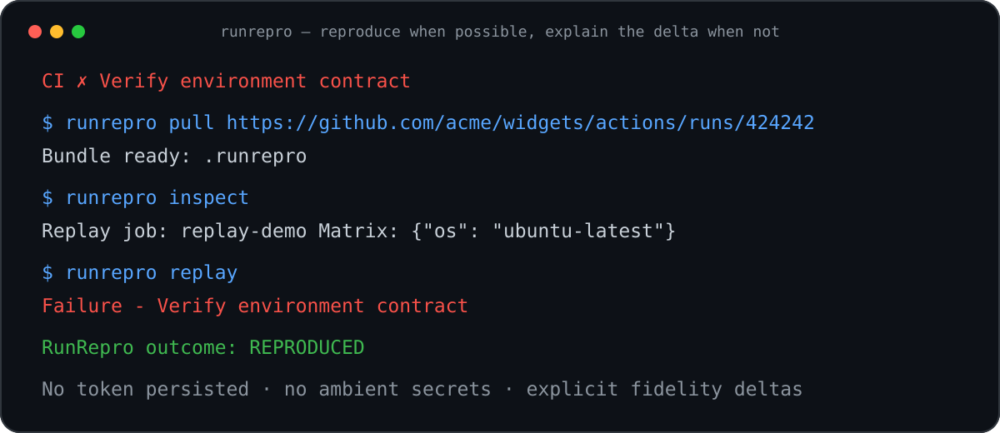
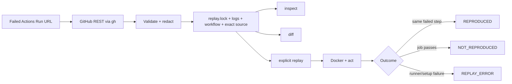

# RunRepro

**Your CI failed. Copy the GitHub Actions Run URL. Reproduce it locally.**

[](https://github.com/hubugui1111-lab/runrepro/actions/workflows/ci.yml)
[](https://www.python.org/)
[](LICENSE)
[](CHANGELOG.md)



```text
CI ❌
  ↓ paste the Run URL
runrepro pull
  ↓ inspect a secret-safe, exact-commit bundle
runrepro replay
  ↓
same failed step locally — or an explicit fidelity delta
```

RunRepro turns a failed GitHub Actions run into an inspectable replay bundle, then delegates local execution to Docker and [`act`](https://github.com/nektos/act). It does not claim a container is a GitHub-hosted VM. Its contract is: **reproduce when possible, explain the delta when not.**

## Install

Requirements: Python 3.11+, [GitHub CLI](https://cli.github.com/) authenticated with `gh auth login`, [Docker](https://docs.docker.com/get-docker/), and [`act`](https://nektosact.com/installation/index.html).

Install directly from GitHub with [`uv`](https://docs.astral.sh/uv/):

```bash
uv tool install git+https://github.com/hubugui1111-lab/runrepro.git
runrepro --help
```

For development:

```bash
git clone https://github.com/hubugui1111-lab/runrepro.git
cd runrepro
uv sync --locked
uv run runrepro --help
```

The `runrepro` distribution name is reserved for a future trusted PyPI release; v0.1.0 is installed from GitHub so no registry credentials are required.

## 30-second quick start

Copy the URL from a failed GitHub Actions run, including `/attempts/N` when you need a specific rerun:

```bash
runrepro pull https://github.com/OWNER/REPO/actions/runs/RUN_ID
runrepro inspect
runrepro diff
runrepro replay
```

`pull`, `inspect`, and `diff` do **not** execute repository code. `replay` does; use it only for code you trust or inside a disposable VM.

A successful reproduction ends with:

```text
Failure - Verify environment contract
RunRepro outcome: REPRODUCED
```

Try the repository's deliberately failing [public demo workflow](.github/workflows/demo-failure.yml), or follow the one-command [demo guide](docs/demo.md).

## Why

A red CI badge rarely tells you whether the cause is code, a matrix cell, an undeclared dependency, a runner image, a missing file, or a service-container assumption. Re-running commits remotely is slow and edits the experiment while you debug it.

RunRepro preserves the incident first:

- exact run attempt, workflow, commit SHA, jobs, failed steps, and sanitized logs;
- static matrix selection, event metadata, artifacts metadata, runner labels, and evidenced image/tool facts;
- a stable `runrepro.replay/v1` manifest that can be code-reviewed and versioned;
- a local replay plan with explicit security controls and explicit unknowns.

## Features

- **URL in, bundle out** — no browser scraping and no manual copying of workflow fragments.
- **Attempt-aware** — accepts canonical run and `/attempts/N` URLs.
- **Exact source and workflow** — both are fetched at the run's `head_sha`.
- **Secret-aware persistence** — honors `::add-mask::`, scrubs common token/credential forms, and rejects secret-like lock metadata.
- **Static matrix inference** — maps rendered job names back to deterministic matrix values.
- **Honest environment diff** — labels every compared fact `MATCH`, `MISMATCH`, or `UNKNOWN`.
- **Safe-by-default `act` plan** — empty secret/var/input files, allowlisted env, bridge networking, no job-container Docker socket, no privileged mode, and bounded resources.
- **Scriptable outcomes** — stable exit codes distinguish a reproduced failure, a non-reproduction, bad input, API failure, bundle failure, and runner failure.

## How it works



The bundle is intentionally plain:

```text
.runrepro/
├── replay.lock          # versioned, non-sensitive JSON
├── event.json           # minimal reconstructed event
├── replay.env           # only CI=true and GITHUB_ACTIONS=true
├── .empty               # explicit empty act secret/var/input source
├── workflow/ci.yml      # exact workflow at head_sha
├── logs/<job-id>.log    # sanitized before persistence
└── workspace/           # bounded exact-commit source archive
```

See the complete [bundle format](docs/bundle-format.md), [design contract](docs/design.md), and [security model](docs/security-model.md).

## CLI

```text
runrepro pull <run-url> [--output PATH]
runrepro inspect [BUNDLE]
runrepro diff [BUNDLE]
runrepro replay [BUNDLE] [--offline] [--act PATH] [--timeout SECONDS]
```

Exit codes:

| Code | Meaning |
|------|---------|
| `0` | command succeeded, or replay matched the expected failed step |
| `2` | invalid input or unsafe request |
| `3` | replay ran but did not reproduce the failure |
| `4` | GitHub/API/authentication failure |
| `5` | bundle or source preparation failure |
| `6` | Docker/`act` runner failure |

`--offline` disables job networking and image pulls. It succeeds only when all required runner images and actions are already cached.

## Failure gallery

[`examples/failures/`](examples/failures/) contains small, manually runnable workflows for:

- missing Python and Node dependencies;
- a failing matrix cell;
- architecture assumptions;
- environment mismatch;
- missing generated files;
- service-container protocol mistakes.

They are fixtures, not enabled CI workflows, so the repository's normal CI remains green. The separate `workflow_dispatch` demo combines a static matrix and environment-contract failure and is intentionally red by design.

## What gets captured — and what does not

| Captured | Deliberately omitted or unknown |
|----------|----------------------------------|
| repository and exact `head_sha` | GitHub token and secret values |
| run attempt, jobs, steps, conclusions | original complete webhook payload |
| exact workflow YAML | dynamic/output-derived matrix resolution |
| sanitized per-job logs | artifact bodies |
| artifact names, sizes, expiry, digest | OIDC identity and environment approvals |
| runner labels and evidenced image/version | byte-for-byte hosted runner filesystem |

## Limitations

v0.1.0 focuses on GitHub.com and Linux jobs using static matrices. Windows, macOS, self-hosted or hardware-specific runners are reported but not faithfully replayed. Complex `include`/`exclude` or `fromJSON` matrices, private dependency credentials, hosted tool caches, nested virtualization, and GitHub service-plane behavior can diverge.

The lightweight Ubuntu replay image optimizes feedback time, not hosted-image parity. Source archives larger than 100 MiB compressed or 512 MiB expanded, more than 50,000 entries, and archives containing links are rejected. See [all fidelity limits](docs/limitations.md).

## Security

Remote workflow code is untrusted. Read [SECURITY.md](SECURITY.md) and the [threat model](docs/security-model.md) before replaying third-party runs. Report vulnerabilities through a private GitHub security advisory.

## Roadmap

- Signed bundle attestations and machine-readable JSON output.
- Better matrix reconstruction for safe `include`/`exclude` cases.
- Pluggable runner-image profiles with measured fidelity scores.
- Opt-in artifact download with strict size/type controls.
- A stable explainer interface that remains optional and never receives secrets by default.

RunRepro will not become a full GitHub Runner replacement, multi-CI SaaS, or mandatory AI repair system.

## Contributing

Issues and focused pull requests are welcome. Start with [CONTRIBUTING.md](CONTRIBUTING.md), follow the [Code of Conduct](CODE_OF_CONDUCT.md), and preserve the test-first security invariants.

## License

Apache License 2.0. See [LICENSE](LICENSE).
